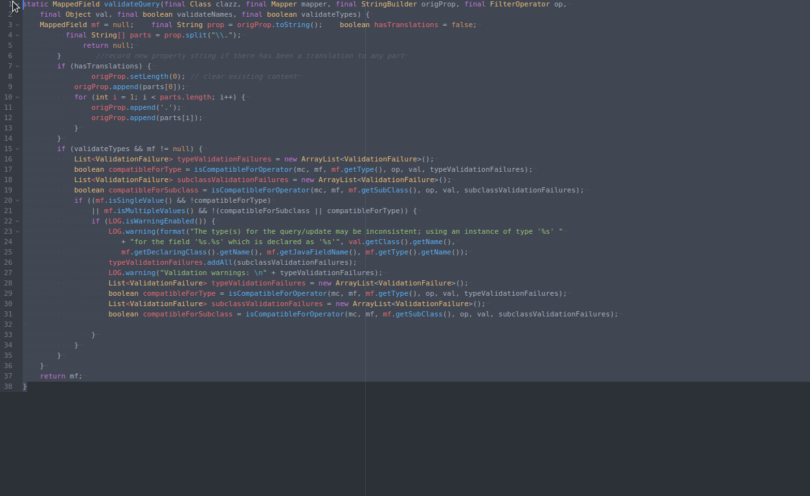

# Fibonacci-indent

An Atom plugin that serves a single purpose: indent your currently selected code based on the Fibonacci sequence.

---

## How it works

After applying to the pre-indented code (with either tabs or spaces), 2 of each space characters (or 1 tab if you're that kind of guy) at the beginning of the line will be converted to the corresponding Fibonacci sequence number.
Feel free to use your code beautifier of choice before fibonazing your tabs.

## Why?

 - It makes your deeply nested code look like spaceships.
 - If your co-worker has spawned another russian doll method, feel free to use this plugin to show how good it actually looks for other people.

---

Please don't use this on any actual code you're intended to share with other human beings in serious projects.
This can also break indent-based languages like Python or Ruby so please be careful.

Somehow inspired by this [vim plugin](https://github.com/dodie/vim-fibo-indent) that does a way better job of handling this.
